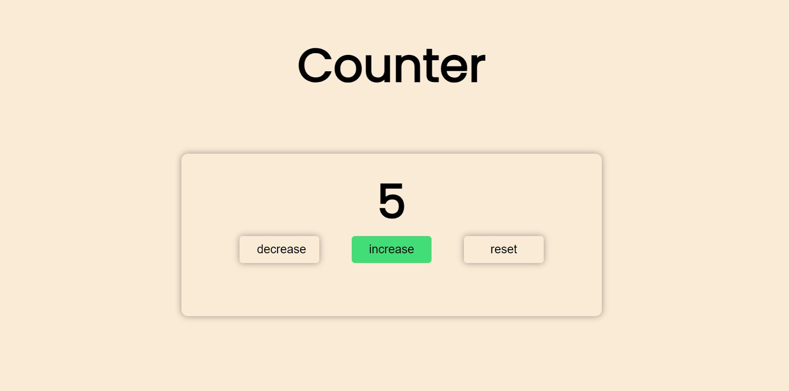

# React Counter Component 📝✨

## Project Description 🧠

### 🎨 **React Counter Component**

I’m excited to present my latest project: a React Counter Component! This component features a straightforward counter with buttons to increment, decrement, and reset the count. Designed with a clean and user-friendly interface, this project highlights fundamental React principles and provides an example of managing state and handling user interactions effectively.

## [Live Demo](https://counter-mini-proj-mj9yxid3d-shogofs-projects.vercel.app/) 🎥

## Demo 📸



## Technologies Used 🛠️

- [React](https://reactjs.org/): JavaScript library for building user interfaces.
- [ReactMarkdown](https://github.com/remarkjs/react-markdown): A Markdown component for React.
- [CSS](https://developer.mozilla.org/en-US/docs/Web/CSS): Custom styles for the application.
- [HTML](https://developer.mozilla.org/en-US/docs/Web/HTML): Structure and content of the web application.

## Installation 💻

To set up the project locally, follow these steps:

1. **Clone the repository:**

   ```bash
   git clone git@github.com:shogof/counter.git
   ```

2. **Navigate to project directory:**

   ```bash
   cd counter
   ```

3. **Install dependencies:**

   ```bash
   npm install
   ```

4. **Start the development server:**

   ```bash
   npm start
   ```

   Open `http://localhost:3000` in your web browser to view the app.

### `MarkdownPreviewer.js`

- **State Management:**

  - `editorValue`: Stores the current Markdown input from the user.

- **handleEditorChange Function:**
  Updates the `editorValue` state with the content from the textarea.

- **Rendering:**
  Displays a textarea for Markdown input and a div for the Markdown preview using `ReactMarkdown`.

## Author 👩‍💻

- **LinkedIn:** [LinkedIn Profile](www.linkedin.com/in/shegofa-developer-aa362030b)
- **Email:** shogofadeveloper12@gmail.com
- **GitHub:** [GitHub Profile](https://github.com/shogof)

## Contributing 🤝

Contributions are welcome! If you'd like to contribute, please follow these steps:

1. **Fork the repository** on GitHub.
2. **Clone your fork** to your local machine:
   ```bash
   git clone https://github.com/yourusername/counter.git
   ```
3. **Create a new branch** for your changes:
   ```bash
   git checkout -b feature/your-feature
   ```
4. **Make your changes** and **commit** them:
   ```bash
   git commit -am 'Add your feature'
   ```
5. **Push** your changes:
   ```bash
   git push origin feature/your-feature
   ```
6. **Submit a pull request** on GitHub.

## Feedback and Support 💬

If you have any questions, feedback, or need support, feel free to reach out via:

- **Issues:** [GitHub Issues](https://github.com/shogof/random-quote/issues)
- **Email:** [email](shogofadeveloper12@gmail.com)
